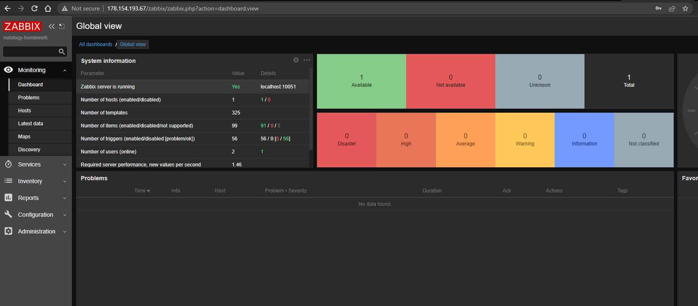
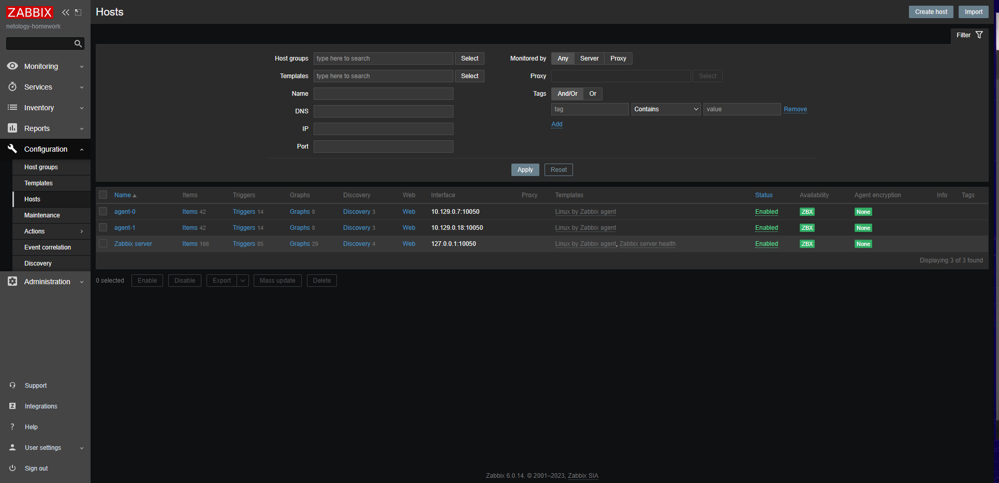
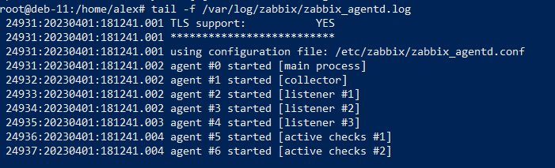
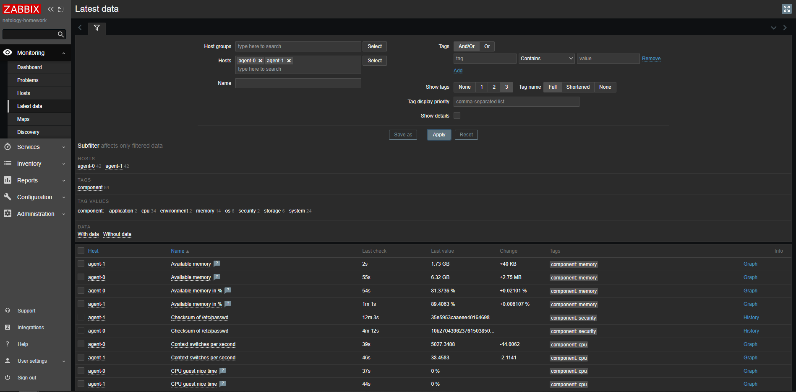

# Домашнее задание к занятию 9.2 "Система мониторинга Zabbix" - Плишешников Алексей

### Инструкция по выполнению домашнего задания

### Задание 1

Установите Zabbix Server с веб-интерфейсом.
Требования к результатам:

1. Прикрепите в файл README.md скриншот авторизации в админке


2. Приложите в файл README.md текст использованных команд в GitHub

```bash 
# apt install postgresql
# wget https://repo.zabbix.com/zabbix/6.0/debian/pool/main/z/zabbix-release/zabbix-release_6.0-4+debian11_all.deb
# dpkg -i zabbix-release_6.0-4+debian11_all.deb
# apt update 
# apt install zabbix-server-pgsql zabbix-frontend-php php7.4-pgsql zabbix-apache-conf zabbix-sql-scripts zabbix-agent
# sudo -u postgres createuser --pwprompt zabbix
# sudo -u postgres createdb -O zabbix zabbix
# zcat /usr/share/zabbix-sql-scripts/postgresql/server.sql.gz | sudo -u zabbix psql zabbix
# nano /etc/zabbix/zabbix_server.conf DBPassword=1234567890
# systemctl restart zabbix-server zabbix-agent apache2
# systemctl enable zabbix-server zabbix-agent apache2
```


### Задание 2
Установите Zabbix Agent на два хоста.
Требования к результатам:

1. Приложите в файл README.md скриншот раздела Configuration > Hosts, где видно, что агенты подключены к серверу


2. Приложите в файл README.md скриншот лога zabbix agent, где видно, что он работает с сервером


3. Приложите в файл README.md скриншот раздела Monitoring > Latest data для обоих хостов, где видны поступающие от агентов данные.


4. Приложите в файл README.md текст использованных команд в GitHub
```
systemctl status zabbix-agent (running)
nano /etc/zabbix/zabbix_agent.conf 
systemctl restart zabbix-agent
systemctl status zabbix-agent (running)
tail -f /var/log/zabbix/zabbix_agentd.log
```
